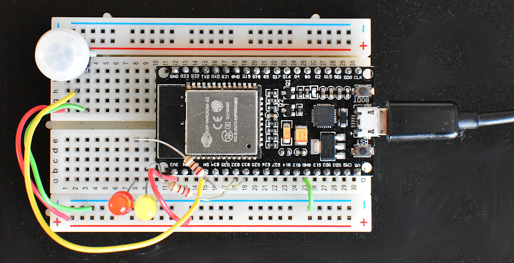

# Battery Powered IoT Devices

## Goal

1. To build [ESP32](http://esp32.net/) based IoT devices for [Home Assistant (HA)](https://www.home-assistant.io/), that run as long as possible on a battery.
2. To get as close as possible to the responsiveness of battery powered Z-Wave binary sensors such as my [AEON Labs, MultiSensor 6](https://aeotec.com/aeotec.com/z-wave-sensor/index.html), model ZW100, Firmware: 1.10, which can run for months off batteries and update a motion sensor in HA UI in about 1s.

## Introduction

Having the ESP32 in deep sleep mode most of the time and paying attention to the power draw of any components still powered in this mode seems like a good place to start, but responsiveness from deep sleep is an issue. 

[Guide to Reduce the ESP32 Power Consumption by 95%](https://diyi0t.com/reduce-the-esp32-power-consumption/) shows that of the boards tested, DFRobot's FireBeetle has the lowest deep sleep power draw. It also has a connector and charger (from USB power) for a 3.7V Lipoly battery. 

We are using [Home Assistant (HA)](https://www.home-assistant.io/) as the IoT hub/controller/user interface and generate firmware with:

 - [ESPHome](https://esphome.io/) for IoT firmware using Wifi; and 
 - [Arduino IDE](https://www.arduino.cc/en/Main/Software_) for IoT firmware using [Bluetooth Low Energy (BLE)](https://en.wikipedia.org/wiki/Bluetooth_Low_Energy) (without WiFi). 

## Experiment 1

### Hardware

This uses an [AS312 (AM312) Mini PIR module](https://unusualelectronics.co.uk/as312-am312-mini-pir-module-review/) to wake up the ESP32 from deep sleep when motion is detected and to send motion detection events. The PIR sensor has to always be powered, but draws very little power. Red and yellow LEDs are available to indicate state. For now I'm using a cheap ESP-WROOM-32 board without particularly good power characteristics.

### Firmware

`esphome/esppir1.yaml` is the ESPHome input file for our first firmware, which uses the HA native API.

LED usage:

- Red: connected to switch `awake`; turned on after waking up; turned off before deep sleep
- Yellow: connected to switch `stay_awake`; HA user turns on to inhibit deep sleep e.g. to facilitate OTA updates. 

### Issues

1. PIR sensor on duration (1 sec) is shorter than the time it takes the ESP32 to startup and the HA api to connect to it. WiFi connection takes 1-2 secs, but it is ~6 secs before the HA API is connected and a change in state is reflected in the HA UI. 
2. State changes before the API is connected are not reflected in the UI after the API connects.
3. Even at the lowest priority, `on_boot` runs before the HA API is connected.
4. The [template binary\_sensor](https://esphome.io/components/binary_sensor/template.html) `motion` can be programatically controlled, but the gpio binary_sensor `pir` cannot.
5. Awake from deep sleep is the same as RST or first boot; (non-RTC) memory is initialised and `setup()` is run, then `loop()` (these are Aduino IDE entry points implemented under-the-hood by ESPHome). I thought that power cycle would clear RTC memory, but it appears to be non-volatile (at least on my current test board) and survives power cycle, RST, OTA update, as well as deep sleep. This means it cannot be used to distinguish between deep sleep wake up and other types of start up. I had wanted to toggle `motion` (see below) only on deep sleep wake up. 

### Implementation

1. Use [template binary\_sensor](https://esphome.io/components/binary_sensor/template.html) `motion` as the high level motion sensor.
2. Under normal operation (`state == 3` in the yaml) `pir` state changes are copied to `motion`.
3. When `pir` wakes the ESP32 `on_boot` is run. It waits for the HA api to connect (or timeout because we don't want to flatten the battery waiting too long) then runs `startup_motion_toggle`.
4. `startup_motion_toggle` turns `motion` on then off (to reflect that `pir` has gone on and off before the HA api was connected) then sets normal operation (`state = 3` in the yaml).
5. `sleep_timer` is restarted when `pir` changes state. When it expires we enter deep sleep (unless `stay_awake` is on).

### Conclusion

Waiting for the HA API to connect is too slow for many applications e.g. to turn on a light for safety or start video recording for security. Using a static IP could shave a little off the WiFi connection time, but not enough to change this.

The long connection delay wouldn't matter for some applications e.g. an analogue soil moisture sensor that sends one or more values each time it wakes up then sleeps a configured period (e.g. 30 min). The sensor need not be powered in deep sleep.

## Experiment 2

### Hardware

Same as `Experiment 1`.

### Firmware

`esphome/esppir2.yaml` is the ESPHome input file for our second firmware, this time using a static IP address and MQTT instead of the HA native API. LED usage is the same as in `Experiment 1`. As the MQTT connection is under the control of the IoT device (rather that waiting for HA to poll it) it should be quicker to establish. The logic is simpler without any need for the template binary_sensor `motion` and the `state` variable.

### Issues

1. It still takes ~4s between a motion event and it being reflected in the HA UI.
2. No MQTT message is generated for the PIR on event that awakens the ESP32. A corresponding PIR off MQTT message is generated.
3. Turning the `awake` switch off and then immediately entering deep sleep, the change of switch state is not reflected in the HA UI (the corresponding MQTT message is not sent).   

### Implementation

1. In `on_boot` we manually send the missing PIR on MQTT message. The automatic PIR off MQTT message is transmitted immediately afterwards, so the on duration is very short. 
2. A 300ms delay between turning the `awake` switch off and entering deep sleep appears to be sufficient for the change of switch state to be reflected in the HA UI. 100ms is not sufficient.

### Conclusion

This is marginally faster (and simpler) than `Experiment 1`, but still too slow for many applications.

## Experiment 3

### Hardware

Same as `Experiment 1`.

### Firmware

`arduinoIde/BLE_server3.ino` is the Arduino IDE source file for our third firmware, this time implementing a [Bluetooth Low Energy (BLE)](https://en.wikipedia.org/wiki/Bluetooth_Low_Energy) server (with no WiFi).

### Issues

1. The [esphome BLE client](https://esphome.io/components/sensor/ble_client.html) can't use Bluetooth security (pair with a PIN) and requires the server MAC address to be configured, which is rather limiting.
2. A proxy will be required to implement the BLE client and send the data to HA (using either the HA native API or MQTT, so it requires WiFi). The proxy would need to be always awake (no deep sleep) and so not battery powered. Using an ESP32 as the proxy, each could handle up to three BLE servers (a limitation of the ESP32 Bluetooth stack). 
3. What happens with multiple simultaneous clients?

### Implementation

This BLE server:

- waits for client connection, enters deep sleep if it doesn't happen by `TIME_CONNECT`
- notifies motion updates, enters deep sleep after `TIME_NOTIFY` since the last update.

After a deep sleep it restarts from scratch and the client must reconnect.

### Test Client

The `nRF Connect` app (on an Android or Apple mobile device) is suitable as a test client. 
With an unpaired client, the sequence of events is:

1. `setup()` completes
2. `loop()` called repeatedly 
3. when the client connects: `MyServerCallbacks::onConnect` is called
4. when the client says yes, pair with the device: `MySecurity::onPassKeyNotify` prints a random PIN
5. when the client enters this PIN: `MySecurity::onAuthenticationComplete` is called
6. the client can then poll or elect to recieve notifications
 
With a previously paired client, the sequence is the same except without step 4.
This sequence, from server wakeup through to the client receiving notifications, can complete in about 1s. 
 
### Conclusion

This matches our goal of achieving close to the responsiveness of Z-Wave devices. 

## Next steps

1. Implement the required proxy to connect the BLE server to HA.
2. BLE mesh networking sounds interesting; Arduino IDE can't do it; Exspressif IDE can but it sounds complicated to implement. 
    

